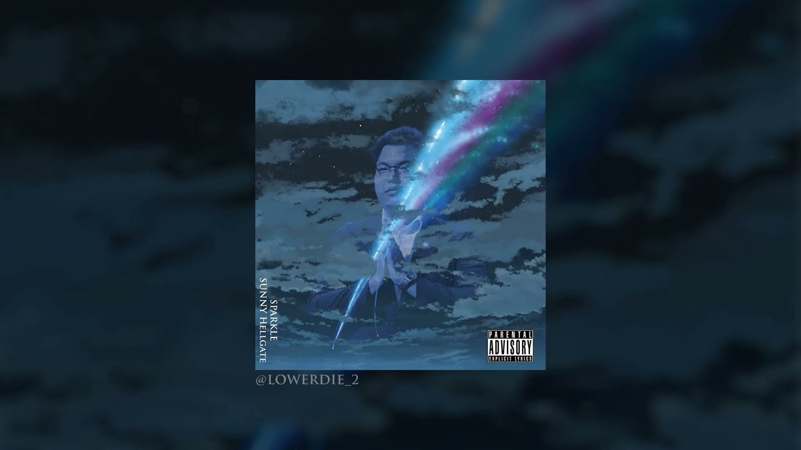

<<p align="center">
  
</p>

# 🎵 Web-Music

เว็บฟังเพลงง่ายๆ ที่ **ไม่ใช้ JavaScript เลย!**  
เขียนด้วย **HTML + CSS** เท่านั้น ✅

---

## 🔗 ลิงก์ที่เกี่ยวข้อง
- 🎶 เพลงประกอบ: [SUNNY HELLGATE - Sparkle](https://www.youtube.com/watch?v=J-IrF917-oE)  
- 🌐 [ตัวอย่างเว็บไซต์](https://enchanting-gecko-a236b9.netlify.app/)  
- 🚀 Deploy ผ่าน: [Netlify](https://app.netlify.com/)  

---

## 📸 Preview
<p align="center">
  
</p>

---

## ✨ คุณสมบัติ
- ไม่มีการใช้ JavaScript
- โหลดไว ใช้ง่าย
- ออกแบบเรียบง่าย เหมาะกับการเรียนรู้โครงสร้างเว็บเบื้องต้น

---

## ⚡ วิธีใช้งาน
1. Clone repo นี้  
   ```bash
   git clone https://github.com/Faris4166/Web-Music.git